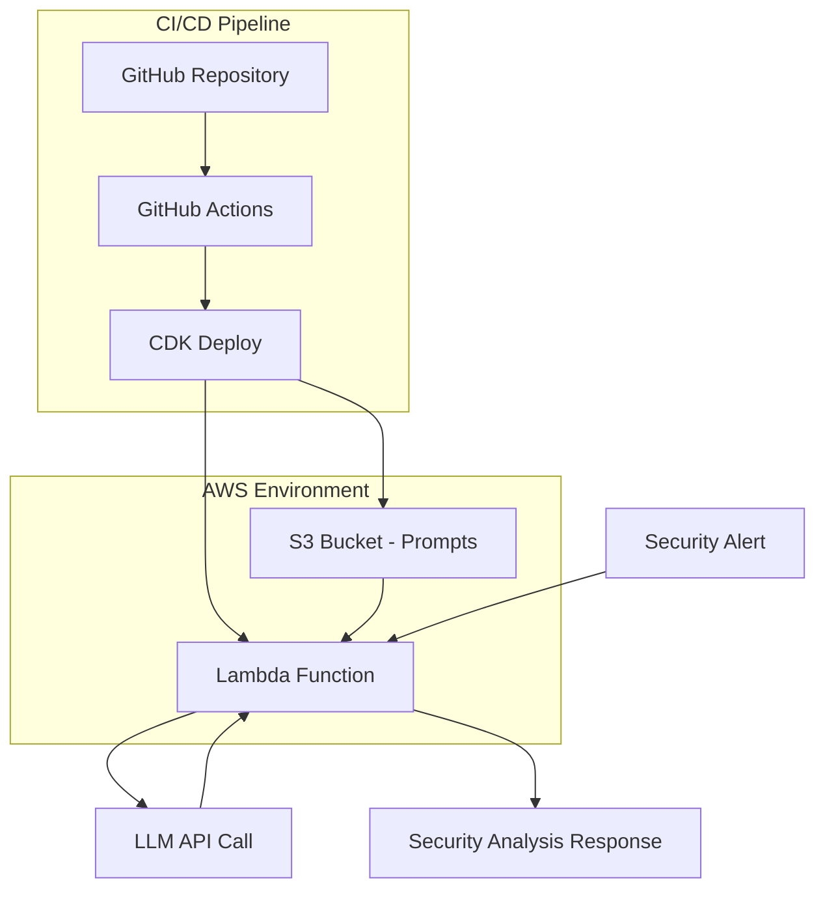

# Agentic Security Tools for AWS

A starter template for agentic security solutions on AWS, using CDK in TypeScript and Go for Lambda/executable code.

---

## Table of Contents

1. [Overview](#overview)
2. [Architecture](#architecture)
3. [Repository Structure](#repository-structure)
4. [Development Workflow](#development-workflow)
5. [Testing](#testing)
6. [CI/CD](#cicd)
7. [Linting and Formatting](#linting-and-formatting)
8. [Prompts](#prompts)
9. [Security Considerations](#security-considerations)
10. [Extending the Project](#extending-the-project)
11. [Makefile Usage](#makefile-usage)
12. [Diagrams](#diagrams)
13. [Getting Started](#getting-started)

---

## Overview

This repository demonstrates a clean and scalable pattern for building security automation and agentic tools on AWS using the best-practice combination of:

- **AWS CDK in TypeScript** for defining cloud infrastructure.
- **Go** for Lambda functions and agent logic.

---

## Architecture



### Component Flow

1. **Prompt Management**: Security analysis prompts are stored in the `prompts/` directory and version-controlled in Git
2. **Automated Deployment**: GitHub Actions automatically deploys prompt changes to S3 and updates the Lambda function
3. **Runtime Processing**: Lambda function dynamically loads the latest prompts from S3 for each security alert analysis
4. **LLM Integration**: The function uses the loaded prompts to make structured API calls to the configured LLM
5. **Response Generation**: Returns formatted security analysis in Markdown format

### Key Benefits

- **Version Control**: All prompt iterations are tracked in Git
- **Zero Downtime Updates**: Prompt changes don't require Lambda redeployment
- **Rollback Capability**: S3 versioning allows instant rollback to previous prompts
- **Environment Separation**: Different prompts can be deployed to different environments
- **Cost Optimization**: Lambda cold starts are minimized by loading prompts from S3

---

## Repository Structure

```
repo-root/
├── cdk/                # TypeScript CDK app and tests
│   ├── bin/            # CDK entrypoint
│   ├── lib/            # CDK stacks and constructs
│   ├── __tests__/      # Unit/integration tests for CDK (TypeScript/Jest)
│   ├── package.json
│   ├── tsconfig.json
│   └── cdk.json        # CDK configuration
├── lambda/             # Go-based Lambda functions
│   ├── go.mod          # Go module dependencies
│   ├── go.sum          # Go dependency checksums
│   ├── handler.go      # Main Lambda handler with S3 prompt loading
│   ├── handler_test.go # Go tests
│   └── dist/           # Compiled binaries (generated)
├── prompts/            # LLM prompts in YAML format
│   └── aws_lambda_security_analysis.prompt.yml
├── sample-events/      # Example Lambda event payloads
│   └── sample-event.json
├── .github/
│   └── workflows/      # GitHub Actions CI/CD
│       ├── ci.yml      # General CI pipeline
│       ├── lint.yml    # Code quality checks
│       └── deploy-prompts.yml # Automatic deployment on prompt changes
├── scripts/            # Utility scripts for development
├── Makefile            # Build automation
├── README.md
├── CONTRIBUTING.md
└── LICENSE
```

### Prompt Management Workflow

The new architecture enables seamless iteration on LLM prompts:

1. **Edit Prompts**: Modify files in the `prompts/` directory
2. **Version Control**: Commit and push changes to GitHub
3. **Automatic Deployment**: GitHub Actions automatically deploys prompt changes to S3
4. **Runtime Loading**: Lambda function dynamically loads the latest prompts from S3
5. **Zero Downtime**: No Lambda redeployment required for prompt updates

### Key Files

- **`prompts/aws_lambda_security_analysis.prompt.yml`**: Main security analysis prompt
- **`lambda/handler.go`**: Lambda function with S3 prompt loading logic
- **`cdk/lib/agentic-security-stack.ts`**: Infrastructure definition including S3 and Lambda
- **`.github/workflows/deploy-prompts.yml`**: Automatic deployment pipeline

---

## Development Workflow

1. **Edit Go Lambda code** in `lambda/handler.go`.
2. **Edit or add unit tests** in `lambda/handler_test.go`.
3. **Build Go binary** (for deployment in Lambda):

   ```sh
   make lambda-build
   ```

4. **Edit CDK infrastructure** code in `cdk/lib/agentic-security-stack.ts`.
5. **Edit or add CDK unit tests** in `cdk/__tests__/`.
6. **Run all tests**:

   ```sh
   make test
   ```

7. **Lint and format code**:

   ```sh
   make lint
   make format
   ```

8. **Synthesize/deploy stack**:

   ```sh
   make deploy
   ```

9. **Test Lambda locally with sample events**:

   ```sh
   make lambda-local
   ```

---

## Testing

- **CDK Infrastructure (TypeScript):**
  - Write tests in `cdk/__tests__/` using [Jest](https://jestjs.io/).
  - Example: `cdk/__tests__/agentic-security-stack.test.ts`
  - Run CDK tests:
    ```sh
    make cdk-test
    ```

- **Go Lambda Functions:**
  - Write tests in files ending with `_test.go` alongside your Go code in `lambda/`.
  - Example: `lambda/handler_test.go`
  - Run Go tests:
    ```sh
    make lambda-test
    ```

- **Run all tests:**
  ```sh
  make test
  ```

---

## CI/CD

This repository is set up for automated linting, testing, and deployments using **GitHub Actions**.  
All pushes and pull requests trigger the workflows in `.github/workflows/`, which run build, lint, and test steps for both TypeScript and Go code.

---

## Linting and Formatting

- **Go:** Uses [`golangci-lint`](https://golangci-lint.run/) for static analysis and `gofmt` for formatting.
- **TypeScript:** Uses `eslint` and `prettier` for linting and formatting.
- Run linter and formatter:
  ```sh
  make lint
  make format
  ```

---

## Prompts

All LLM prompts and agent instructions are located in the [`prompts/`](./prompts/) directory.  
Edit these files to adjust agent behavior, detection instructions, and remediation templates.

---

## Security Considerations

- Least-privilege IAM roles for Lambda functions.
- Use environment variables or AWS Secrets Manager for sensitive data.
- Use CDK’s constructs to manage VPC, encryption, logging, and monitoring.
- **Do not commit secrets.** Use `.env.example` as a template for your environment variables.

---

## Extending the Project

- Add more Lambda functions by creating more Go files in `lambda/` and referencing them in the CDK stack.
- Add other resources (S3, DynamoDB, etc.) using CDK constructs in `cdk/lib/agentic-security-stack.ts`.
- Write tests for Go code and CDK stacks.
- Add prompt templates to the `prompts/` directory.
- Add sample Lambda event payloads to `sample-events/` for local testing.
- Contribute using the guidelines in [`CONTRIBUTING.md`](./CONTRIBUTING.md).

---

## Makefile Usage

A set of well-defined targets is provided for local development, testing, linting, and deployment.

```sh
make               # Show help for common targets
make setup         # Setup environment variables and configuration
make lambda-build  # Build Go Lambda binary for deployment
make lambda-test   # Run Go Lambda unit tests
make lambda-local  # Invoke Go Lambda locally with sample event
make lambda-invoke # Invoke deployed Lambda function with sample event
make cdk-test      # Run CDK (TypeScript) unit tests
make lint          # Lint both Go and TypeScript code
make format        # Format both Go and TypeScript code
make test          # Run all tests
make deploy        # Deploy the stack using CDK (includes setup)
make clean         # Clean build artifacts
```

---

## Diagrams

### High-Level Architecture

```mermaid
flowchart TD
  subgraph CDK [CDK App (TypeScript)]
    direction TB
    stack1[AgenticSecurityStack]
  end
  subgraph Lambda [Lambda (Go)]
    direction TB
    handler[handler.go]
  end
  User -.-> CDK
  CDK --> Lambda
  Lambda --> AWS[(AWS Services)]
  CDK --> AWS
```

---

## Getting Started

### Prerequisites

- [Node.js](https://nodejs.org/) (v20 or later)
- [Go](https://golang.org/) (v1.23.x or later)
- [AWS CLI](https://aws.amazon.com/cli/) (configured with your credentials)
- [AWS CDK](https://docs.aws.amazon.com/cdk/latest/guide/getting_started.html) (install globally with `npm install -g aws-cdk`)

### Quick Start

1. **Clone the repository:**
   ```sh
   git clone <repo-url>
   cd aws-agentic-security-template
   ```

2. **Automated Setup (Recommended):**
   ```sh
   # Setup environment and deploy everything
   make setup
   make deploy
   ```

3. **Test the deployed Lambda function:**
   ```sh
   make lambda-invoke
   ```

That's it! The automated setup will:
- Detect your AWS account and region automatically
- Configure environment variables
- Build the Go Lambda binary
- Deploy the CDK stack with S3 prompt storage
- Upload prompts to S3

### Manual Setup (Alternative)

If you prefer manual setup or need customization:

1. **Install dependencies:**
   ```sh
   cd cdk && npm install
   cd ../lambda && go mod tidy
   ```

2. **Configure environment:**
   ```sh
   cp .env.example .env.local
   # Edit .env.local with your settings
   ```

3. **Build and deploy:**
   ```sh
   make lambda-build
   make deploy
   ```

### Using Different AWS Profiles

For AWS SSO users:
```sh
AWS_PROFILE=your-sso-profile make deploy
```

### Testing

```sh
# Run all tests
make test

# Test individual components
make lambda-test      # Go unit tests
make cdk-test         # CDK unit tests
make lambda-invoke    # Test deployed function
```

For more details, see the [Copilot Instructions](.github/workflows/copilot-instructions.md).